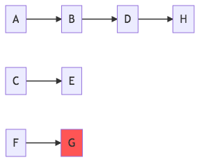

# StopTrades

An Implementation

---
### Outline

- Architecture and responsibilities
- Creating messages
- The StopTrade Client
- Resolving messages

---

Although mature, this is still work in progress.

@box[bg-orange text-white rounded demo-box-pad](If you find flaws in the architecture or implementation - let me know!)

---


#### ADR Goals

@snap[tight-bullets]

@ul
- @size[0.5em](Each service that can “produce” stopped trade has API that allows resubmission of stopped trades)
- @size[0.5em](Stopped trade entity is owned by each service that produced it)
- @size[0.5em](When service stops a trade it will produce a stopped trade that will be broadcast for manual intervention and possibly resubmission back to that service)
- @size[0.5em](The broadcast stopped trade will have information about which API can be used to resubmit it and what fields can be modified)
- @size[0.5em](API will accept stopped trade, synchronously or asynchronously respond that it resubmitted it and broadcast updated state of the stopped trade. This may make the stopped trade not stopped any more)
@ulend

@snapend

---


Will use SBL as an example


---?include=md/service-roles/PITCHME.md

---

StopTrade message lifecycle

---?include=md/sequence-flow/PITCHME.md

---
@title[Considerations from a target machine perspective]

### A Producers Considerations

@ul
- Amount of errors sent to stop trades
- How to produce a good, meaningful, error message
- Level of dynamics
  - editable fields
  - common fields
- Circuit break strategy
@ulend

---

@snap[north-east]
**Amount of errors sent**
@snapend

@box[bg-orange text-white rounded demo-box-pad](StopTrades is something rare - keep it simple!)

---

@snap[north-east]
**Amount of errors sent**
@snapend

##### Up to target machine to know what and how resubmission should work

@ul
- Simple cases are simple
- Complex editable stop trades will require quite some code
@@ulend

---

@snap[north-east]
**Produce good error messages**
@snapend


@ul
- Few details will make it difficult for user
- many details will make it difficult for you :)
@@ulend

Note:

- highlight the differences and that it is not obvious that you should go all in (in either of the directions.
- It is hard to foresee what _that_ user needs to know when she is viewing stop trade messages.)]

---

@snap[north-east]
**Level of Dynamics**
@snapend

@ul
- Stop trade UI should be easy (no `new trade` window)
- The user should only be able to do trivial changes.
- How do you know what fields a user might be able to edit?
- Each error case must be thought through and evaluated -> lots of work.
@ulend

Note:

stop trade UI should not be able to do the same things as the originating system

---

@snap[north-east]
**"Circuit Break" strategy**
@snapend

###### Up to target machine to decide if service should

@ul
- stop process messages completely (_service crash_)
- stop a branch of messages (_grouped error management_)
- continue as normal (_pass through_)
@ulend


---?include=md/sbl-akka/PITCHME.md


### Stop Trade Carrier


```json
{
  "eventType": "New",
  "payload": { },
  "metadata": { }
}
```

Due to this structure it is easy to change the format of the payload without breaking stuff.

---

#### EventType

- `New` - new stop trade, will be put in store
- `Delete` - remove stop trade message from the store

---

#### `metadata`

```json
{
  "correlationId": "45tg4557-234r6-67y",
  "originalSystem": "BETS CLIENT"
}
```

This is common structure altrough our event based stack.
See ADR 008

---

### `payload` - `New`

```json
{
  "source": "SBL STATE APPLIER",
  "sourceId": 8912,
  "errorMessage": "Settlement is not implemented",
  "groupPath": ["18120300001N", 8912],
  "commonValues": {
    "refNo": "18120300003N"
  },
  "editableFields": [
    {
      "name": "Volume",
      "fieldType": "double",
      "value": 5000.0
    }
  ]
}
```

@[2-3](index keys - required)
@[4-8](UI structure enhancement)
@[9-15](resolve)

---

#### `groupPath`

Information for UI to build tree-like relations between (independent) messages.

```text
A
|- 1          groupPath: ["A", "1"]
|- 3          groupPath: ["A", "3"]
B
|- 2          groupPath: ["B", "2"]
```

@[1-2],
@[1-2,4-5]
@[1-5]


---

@snap[north seq-flow]

@snapend

```text
A: ["A", 1]
B: ["A", 2]
C: ["C", 3]
D: ["A", 4]
E: ["C", 5]
F: ["F", 6]
G: ["F", 7]
H: ["A", 8]
```

---

#### `commonValues`

plain key-value dict to show more info / provide better context to user.

```json
{
  "refNo": "18120300003N"
}
```

---

#### `editableFields`

@ul
- Generic way to let user update _specific_ values in stop trade client
- will override values on the resolved message in the target machine
@ulend

---

```json
{
  "price": 100,    /* original message */
  "volume": 5000
}

{
  "volume": 4500  /* from resolved stop trade */
}

{
  "price": 100,   /* updated message */
  "volume": 4500
}
```

@[1-4](error payload)
@[6-8](stop trade payload)
@[10-13](resolved payload)

---?color=linear-gradient(to right, #c02425, #f0cb35)

#### `editableFields` - considerations

For which type of error should a specific field be editable?

---

### `payload` - `Delete`

```json
{
  "source": "SBL STATE APPLIER",
  "sourceId": 8912
}
```

