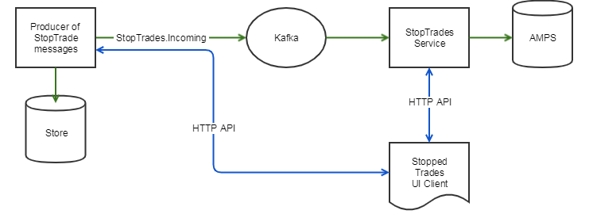

# StopTrades

An Implementation


---

#### Generate Message

---

Considerations from a target machine perspective

- Amount of errors sent to stop trades
- How to produce a good, meaningful - error message
- Level of dynamics (editable fields, common fields)
- Circuit break strategy

---

Up to target machine to know what and how resubmission should work

@ul
- Simple cases are simple
- Complex editable stop trades will require quite some code
@@ulend

---

@box[bg-orange text-white rounded demo-box-pad fragment](StopTrades is something rare - keep it simple!)

@box[bg-orange text-white rounded demo-box-pad fragment](One message per error type)

---

Up to target machine to decide if service should

- stop process messages completely (_service crash_)
- stop a branch of messages (_grouped error management_)
- continue as normal (_pass through_)

---

SBL Example

---

### Stop Trade Carrier


 ```json
{
  "eventType": "New",
  "payload": { },
  "metadata": { }
}
 ```

Due to this structure it is easy to change the format of the payload without breaking stuff.

---

#### EventType

- `New` - new stop trade, will be put in store
- `Delete` - command to remove the stop trade message from the store

---

#### Metadata

```json
{
  "correlationId": "45tg4557-234r6-67y",
  "originalSystem": "BETS CLIENT"
}
```

---

### Payload - New


```json
{
  "source": "SBL STATE APPLIER",
  "sourceId": 8912,
  "errorMessage": "Settlement is not implemented",
  "groupPath": ["18120300001N", 8912],
  "commonValues": {
    "refNo": "18120300003N"
  },
  "editableFields": [
    {
      "name": "Volume",
      "fieldType": "double",
      "value": 5000.0
    }
  ]
}
```

@[2-3](index keys - required)
@[4-8](UI structure enhancement)
@[9-15](resolve)

---

#### GroupPath

Information for UI to build tree-like relations between (independent) messages.

```text
A
|- 1          groupPath: ["A", "1"]
|- 3          groupPath: ["A", "3"]
B
|- 2          groupPath: ["B", "2"]
```

@[1-2],
@[1-2,4-5]
@[1-5]


---

#### CommonValues

plain key-value dict to show more info / provide better context to user.

```json
{
  "refNo": "18120300003N"
}
```

---

#### EditableFields

Generic way to let user update _specific_ values in stop trade client,
which will override values on the resolved message in the target machine.


```json
{
  "price": 100,
  "volume": 5000
}

{
  "volume": 4500
}

{
  "price": 100,
  "volume": 4500
}
```

@[1-4](error payload)
@[6-8](stop trade payload)
@[10-13](resolved payload)

---

#### EditableFields

For which type or error should a specific field be editable?

### Payload - `Delete`

```json
{
  "source": "SBL STATE APPLIER",
  "sourceId": 8912
}
```

---
### Outline

- Architecture and responsibilities
- Creating messages
- The StopTrade Client
- Resolving messages

---

Although mature, this is still work in progress.

@box[bg-orange text-white rounded demo-box-pad](If you find flaws in the architecture or implementation - let me know!)

---

@snap[north-west]
@size[1.5em](ADR Goals)
@snapend

@ul
- Each service that can “produce” stopped trade has API that allows resubmission of stopped trades. (For example Equilend, ION STP etc.)
- Stopped trade entity is owned by each service that produced it
- When service stops a trade it will produce a stopped trade that will be broadcast (through Kafka and AMPS) for manual intervention and possibly resubmission back to that service
- The broadcast stopped trade will have information about which API can be used to resubmit it and what fields can be modified
- API will accept stopped trade, synchronously or asynchronously respond that it resubmitted it and broadcast updated state of the stopped trade. This may make the stopped trade not stopped any more
- AMPS is used as an API to get stopped trades
- We reuse existing Stopped Trades window in order to not confuse users with yet another stopped trades window
@ulend
---

@snap[north-west]
@size[1.5em](Overview)
@snapend

@snap[east fragment]
Producer

 - produces stop trade messages, dispatches on kafka
 - Implements HTTP API to let stop trade client send commands to resolve stop trades. Replies if resolving was successful or not
@snapend

@snap[east fragment]
StopTrade Service

- Consumes from kafka
- Stores messages in AMPS
- Has HTTP API so that client can list, query and delete stop trade messages
@snapend

@snap[east fragment]
StopTrade Client

- Display stop trade messages in a "good way"
- Allows user to edit and resolve stop trade messages
@snapend

@snap[west]

@snapend


---


```
{
  "eventType": "New",
  "payload": {
    "resubmitUrl" : "http://y12345/ngt/api/v1/resolve",
    "source": "SBL StateApplier",
    "sourceId": "180903123456",
    "groupPath": ["18120300001N", "18120300003N"],
    "errorText" : "Settlement is not implemented",
    "hash" : "=1f345234tf324q6y3t42hwrj8",
    "commonValues" : {
      "counterpart": "NYBK",
      "instrument" : "DKTEST000001",
    },
    "editableFields": [
      {
        "name": "Volume",
        "fieldType": "double",
        "value": "5000"
      }
    ]
  },
  "metadata":{
    "correlationId": "23544543-345652-sfe3",
  }
}
```
---

```
public class RawStopTradeCarrier
{
    public StopTradeEventType EventType { get; set; }  // New | Delete
    public BaseStopTradeMessage Payload { get; set; }
    public Metadata Metadata { get; set; }
}

// for Delete commands
public class BaseStopTradeMessage
{
    public string Source { get; set; }
    public string SourceId { get; set; }
}

// for New commands
public class StopTradeMessage : BaseStopTradeMessage
{
    public List<string> GroupPath { get; set; }
    public string ErrorText { get; set; }
    public Dictionary<string, string> CommonValues { get; set; }
    public List<FieldInformation> EditableFields { get; set; }
}
```

---
